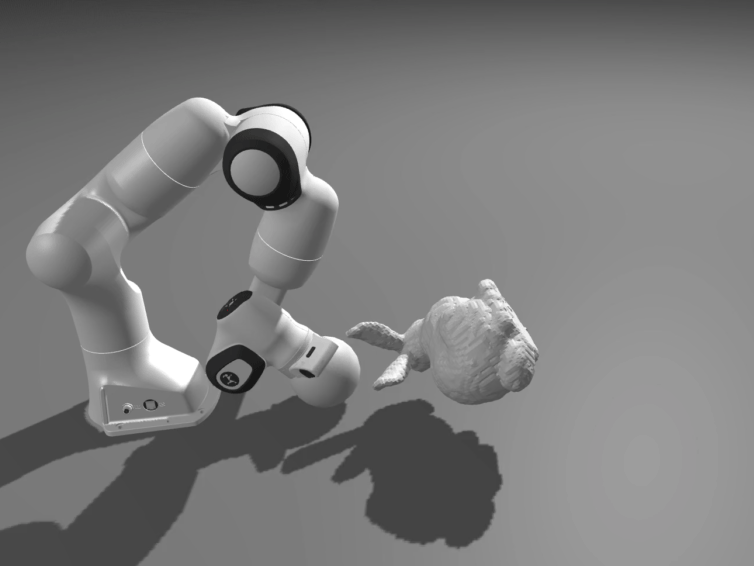

### Hi there I'm Simon! 👋

I'm currently Research Scientist Intern @ [Google Robotics](https://research.google/teams/brain/robotics/) and PhD candidate @ [Stanford University](https://www.stanford.edu/) working with [Zachary Manchester](https://www.ri.cmu.edu/ri-faculty/zachary-manchester/) and [Mac Schwager](https://web.stanford.edu/~schwager/). 

Previously:
- software engineering intern at [Aurora Innovation](https://aurora.tech/)
- undergraduate student at [Ecole Centrale Paris](https://www.centralesupelec.fr/)

## Notable Papers
* [Dojo: A Differentiable Physics Engine for Robotics](https://arxiv.org/abs/2203.00806)
* [Fast Contact-Implicit Model-Predictive Control](https://arxiv.org/abs/2107.05616)
* [ALGAMES: a fast augmented Lagrangian solver for constrained dynamic games](https://link.springer.com/article/10.1007/s10514-021-10024-7) [code](https://github.com/RoboticExplorationLab/Algames.jl)

## Top Open Source Projects
| :gift: project name | :book: brief description | language |
| ------------ | ----------------- | -------- |
| [Dojo.jl](https://github.com/dojo-sim/Dojo.jl) | a differentiable physics engine for robotics |  |
| [ContactImplicitMPC.jl](https://github.com/dojo-sim/ContactImplicitMPC.jl) | a model preditive controller for robots that make and break contact |  |
| [Algames.jl](https://github.com/RoboticExplorationLab/Algames.jl) | SotA dynamics games solver |  |

#### Side Project: trying to create nice looking animations
| Unitree A1 | Boston Dynamics Atlas | Panda Arm | Tugging Drone |
| --- | --- | --- | --- |
|  |  |  |  | 

I'm using Robin Deits' [MeshCat.jl](https://github.com/rdeits/MeshCat.jl) and developing [RobotVisualizer.jl](https://github.com/simon-lc/RobotVisualizer.jl) to make it prettier.
